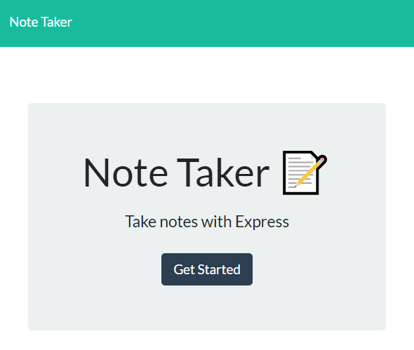
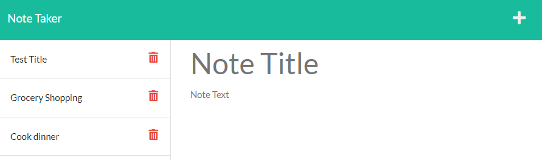

# <Note Taker>

## Description

This application allows the user to have an easily accessible way to keep an archive of notes. 

## Installation

No installation necessary. Application can be used at https://boiling-brushlands-36873.herokuapp.com/notes

## Usage

User is first presented with this landing page. User can click to access the note taker app.

User can type out their note on the right side and once saved, it will appear on the list on the left side.

## Credits

Application was deployed through heroku https://dashboard.heroku.com/apps

